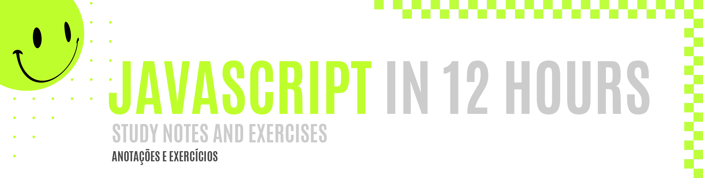
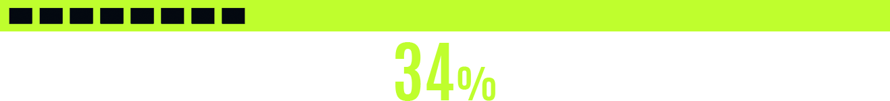

 
 

 
 

 

Clever Programmer is a youtuber who helps a lot of of begginners and intermediates to dive deep into many programming languages. I'm following his 12 hours course for JavaScript, and I'm learning a lot for now, since I've started it as a complete begginner, and now I'm pretty proud of the point I'm on right now. I did not finish it yet, but I'm really excited to come back as soon as possible!

##### O Clever Programmer é um youtuber que ajuda muitos iniciantes e estudantes intermediários a ter um maior contato com várias linguagens de programação. Estou seguindo o curso de 12 horas sobre JavaScript, e estou aprendendo muito, porque iniciei meus estudos como uma iniciante completa, e agora estou bastante orgulhosa do ponto em que cheguei. Ainda não finalizei o curso, mas estou animada em retornar assim que possível!

 
 
 
 

 

 
 
 
 

 

|  Topic       |  Content        |  Done        |
| ------------------ | ------------------ | :--------------------------------------------: |
|  JavaScript      | Functions, data types, loops, fetch |  |
|  More updates soon!      |   |

 
 
 
 
 

